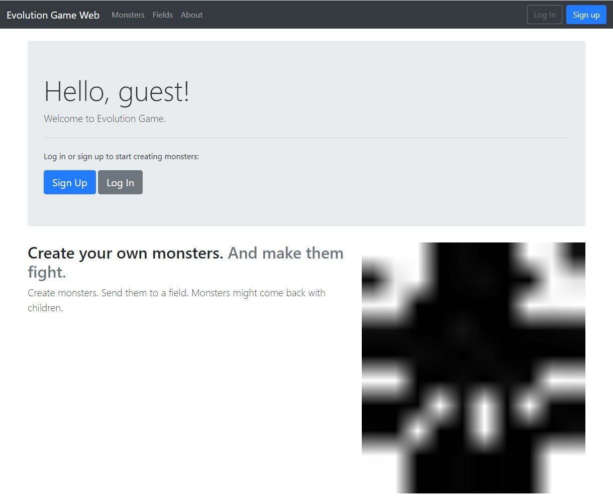
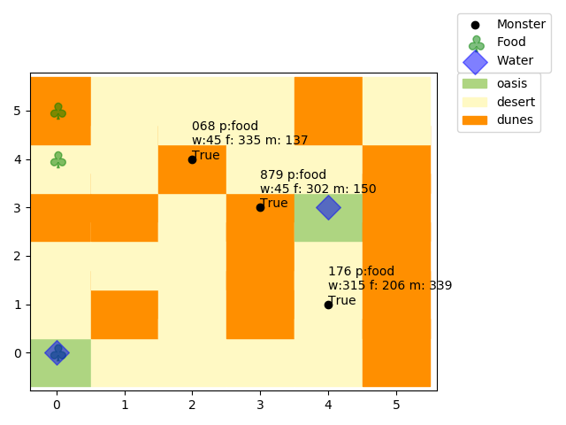

# Evolution Fight

Evolution Game is a simulation of monsters in an environment. It uses an evolutionary algorithm to determine the best suited monster in the environment.

# Web

A Django app is currently deployed on [www.kanji.works](http://www.kanji.works/). 

## Screenshots

# Visualisation
Visualisation is done by matplotlib. 

Example image of a field (as of 30/05/2019):

# Monsters

Monsters get unique appearances reflecting their genes.

# Rules

## Fields
- A field contains a subfield in every grid.
- A field has a biome.
- Subfields have a subbiome corresponding to the current biome.
- Subfields may or may not contain food. 
- Subbiomes determine how much water there is in the subfield.
- A field is considered to have water if it is above the water threshold.

## Monsters
- If a monster dies it will be removed from the field.
- Monster's will move around the field's subfield. A monster can move in 8 directions.
- The monster's food and water values will be decreased by 0.1 of the maximum capacity of the monster each turn.
- A monster will prioritise finding food/water when food/water is low.
- A monster will eat/drink if food/water value is low and there is food/water on the current subfield.
- A monster can eat other monster's if the size is larger than the other monster.

### Genes
- The gene of a monster is determined by the genes of the mother and father (heredity).
- The monster's stats are determined by the phenotype of the gene. 
- Non-phenotype genes are still stored in the gene and can be inherited to children.
